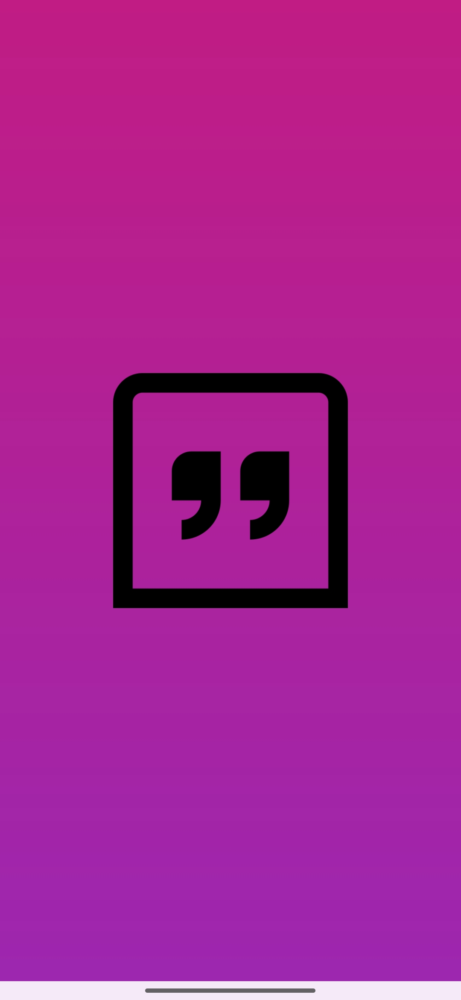
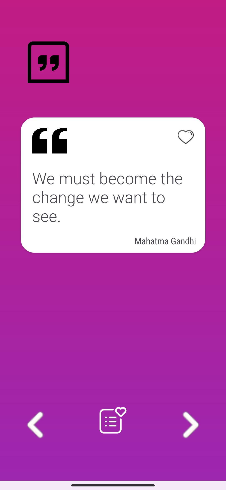

# Quotify

<div align="center">
  
</div>

------
Quotify is a simple and fun Android application that provides users with an inspiring collection of quotes. Quotify allows users to read, search, and save their favorite quotes in a smooth and intuitive UI.


## Features ⭐

- **Browse Quotes**: Explore a wide range of quotes from different authors.

- **Search Functionality**: Quickly find the quote you're looking for with the built-in search feature.

- **Favorite Quotes**: Mark your favorite quotes and access them easily.

- **Save Last Viewed Quote**: Automatically loads the last quote you viewed on reopening the app.

- **Gradient Themed UI**: Beautiful linear gradient background for a visually appealing experience.


## Tech Stack  🤖⚡

- **Kotlin**: For Android app development.

- **XML**: UI toolkit for building native Android UIs.

- **Room Database**: To store and retrieve favorite quotes locally.

- **ViewModel & LiveData**: For managing UI-related data in a lifecycle-conscious way.

- **Gradle Kotlin DSL**: For dependency and build management.

---

## Screenshots and Videos 📸

### Screenshots of the App
Here are some screenshots showcasing the key features of Quotify.

<div align="start">
  
  
  
</div>

### Demonstration Video
Watch the demonstration video to see Quotify in action:

[](https://youtu.be/1GdsrZXKozU)


## Installation 📱

To run this project locally:

1. Clone the repository:

   ```bash
   git clone https://github.com/KaranJoshi1208/Quotify.git
   ```

1. Open the project in Android Studio.

1. Build and run the project on an emulator or physical device.


## Contributing 😊

#### If there is anything that could be done in a better or efficient way , feel free to let me know.<br>You can also add features you think would enhance the project.

### How to Contribute

1. **Fork the Repository**

   Click the "Fork" button at the top right corner of the repository page to create your own copy of the project.

2. **Create a New Branch**

   Use the command below to create a new branch for your feature or fix:
   ```bash
   git checkout -b feature/YourFeature

3. **Make Your Changes**

   Edit the code and make your improvements! Don't forget to test your changes.

4. **Commit Your Changes**

   Once you’re satisfied, commit your changes with a clear message:

   ```bash
   git commit -m "Added feature"
   ```
5. **Push to Your Branch**

   Push your changes to your forked repository:
   ```bash
   git push origin feature/newFeature
   ```
6. **Open a Pull Request**

   Go to the original repository and click on "New Pull Request.",<br>Provide a description of your changes and submit it for review!
---
